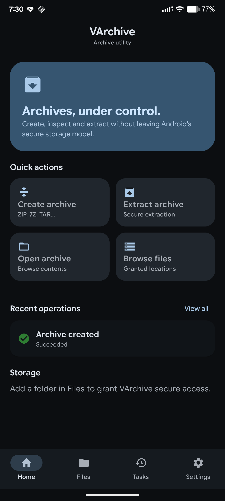
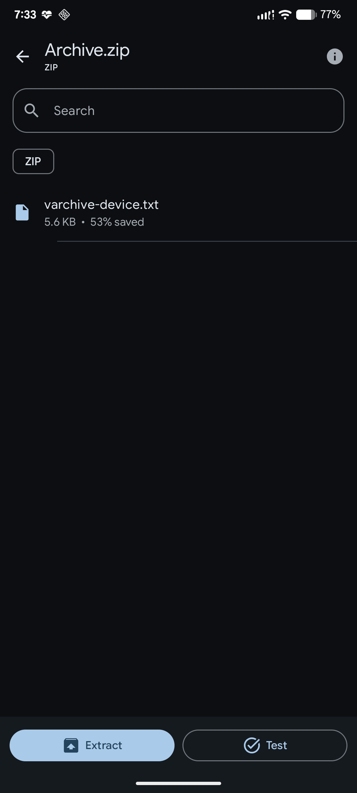
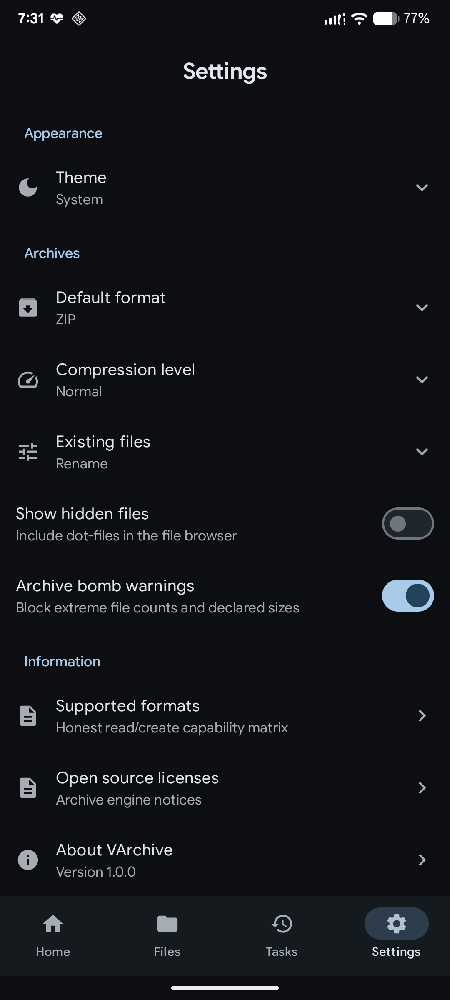
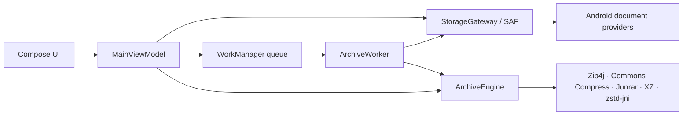

<div align="center">

# VArchive

### A modern, secure and powerful archive manager for Android.

[](https://github.com/vikas0vks/VArchive/actions/workflows/android.yml)
[](#build-from-source)
[](#tech-stack)
[](#download)
[](https://github.com/vikas0vks/VArchive/releases/latest)

[Features](#highlights) · [Formats](#supported-formats) · [Download](#download) · [Security](#security) · [Build](#build-from-source) · [License](#license)

</div>

VArchive brings browsing, creation, extraction, and integrity testing into one focused Android application. It works through Android's Storage Access Framework instead of broad storage permissions, keeps long-running work off the UI thread, and exposes only capabilities implemented by its archive engine.

## Highlights

- Create ZIP/ZIP64, 7Z, TAR-family, GZIP, BZIP2, XZ, and ZSTD archives.
- Browse and extract RAR/RAR5, AR/DEB outer containers, and CPIO in addition to all creatable formats.
- Create and extract AES-256 encrypted ZIP files.
- Inspect archive contents and run full integrity tests before extraction.
- Compress multiple files or complete folders while preserving relative paths.
- Run heavy work in a serialized WorkManager queue with progress, speed, foreground notifications, and cooperative cancellation.
- Detect formats from file signatures before falling back to extensions.
- Choose system, light, dark, or AMOLED themes.

## Screenshots

<p align="center">
  
  &nbsp;
  
  &nbsp;
  
</p>

Screenshots are captured from the real v1.0.0 application on Android 16 using neutral test data.

## Supported formats

| Format | Browse | Extract | Create | Encryption | Test |
|---|:---:|:---:|:---:|---|:---:|
| ZIP / ZIP64 | Yes | Yes | Yes | AES-256 create/read | Yes |
| 7Z | Yes | Yes | Yes | Password read; no encrypted creation | Yes |
| RAR / RAR5 | Yes | Yes | No | Password read where supported | Yes |
| TAR | Yes | Yes | Yes | No | Yes |
| TAR.GZ / TGZ | Yes | Yes | Yes | No | Yes |
| TAR.BZ2 / TBZ2 | Yes | Yes | Yes | No | Yes |
| TAR.XZ / TXZ | Yes | Yes | Yes | No | Yes |
| TAR.ZST | Yes | Yes | Yes | No | Yes |
| GZIP | Single stream | Yes | One file | No | Yes |
| BZIP2 | Single stream | Yes | One file | No | Yes |
| XZ | Single stream | Yes | One file | No | Yes |
| ZSTD | Single stream | Yes | One file | No | Yes |
| AR / DEB outer container | Yes | Yes | No | No | Yes |
| CPIO | Yes | Yes | No | No | Yes |

RAR support is intentionally extraction-only. ISO, CAB, LZH/LHA, WIM, XAR, and RPM payload decoding are not claimed by this release.

## Security

VArchive treats every archive entry as untrusted input. Before a file reaches the selected destination, the extraction pipeline:

- rejects absolute paths, Windows drive paths, control characters, empty paths, and `..` traversal;
- resolves every output path canonically beneath an app-private extraction root;
- blocks TAR symbolic/hard links and RAR redirections;
- enforces declared-size and entry-count limits before extraction;
- applies an explicit rename, overwrite, skip, or fail-safe conflict policy;
- keeps passwords out of preferences, logs, and persistent WorkManager input data;
- removes private work directories after success, failure, or cancellation.

The manifest requests no internet or broad storage permission. Storage access is granted by the user through Android's document and directory pickers. See [SECURITY.md](SECURITY.md) for reporting guidance and [ARCHIVE_ENGINE.md](ARCHIVE_ENGINE.md) for the complete engine boundary.

## Android integration

- Storage Access Framework for files, folders, output documents, and persisted tree grants
- Android share/open intents for supported archive MIME types
- WorkManager foreground execution for long operations
- Adaptive and monochrome launcher icons
- Material 3 UI with TalkBack labels and dynamic system theme support

## Architecture



Archive libraries remain behind a Kotlin `ArchiveEngine` interface. Content URIs are streamed directly where possible and staged only in app-private work directories when a backend needs random access. UI, storage, background operations, settings, and archive-domain code are kept in separate packages.

## Download

Download the latest installable APK from [GitHub Releases](https://github.com/vikas0vks/VArchive/releases/latest).

- Minimum Android version: **Android 8.0 / API 26**
- Current packaged ABI: **arm64-v8a**
- Package name: **`com.vikas.varchive`**

The v1.0.0 release APK is signed with an Android development key for testing and direct installation. It is not production/store signed. Verify the accompanying `.sha256` file before installing.

## Build from source

### Requirements

- JDK 17 or newer
- Android SDK Platform 36 and Build Tools 36.x
- Git

```bash
git clone https://github.com/vikas0vks/VArchive.git
cd VArchive
./gradlew testDebugUnitTest lintDebug assembleDebug
```

On Windows:

```powershell
git clone https://github.com/vikas0vks/VArchive.git
cd VArchive
.\gradlew.bat testDebugUnitTest lintDebug assembleDebug
```

Build outputs are written beneath `app/build/outputs/apk/`. A release build can be created with `./gradlew assembleRelease`; the checked-in configuration uses the development key and contains no private signing material.

## Tech stack

- Kotlin 2.2 and coroutines
- Jetpack Compose and Material 3
- AndroidX Lifecycle, DataStore, DocumentFile, and WorkManager
- Apache Commons Compress 1.28.0
- Zip4j 2.11.6
- XZ for Java 1.12
- zstd-jni 1.5.7-12
- Junrar 8.1.1

Dependency roles and license boundaries are documented in [THIRD_PARTY_NOTICES.md](THIRD_PARTY_NOTICES.md).

## Testing

Current v1.0.0 validation includes:

- **19 JVM unit/integration tests** covering detection, options, path safety, bomb limits, encryption, corruption, and archive round trips;
- **4 Android instrumentation tests** covering core UI, Android-runtime codec round trips, encrypted/corrupt archive handling, and RAR5 extraction;
- Android lint with zero errors;
- R8/resource-shrunk release assembly;
- real-device SAF create, browse, test, and extract flows on Android 16;
- release installation, cold start, and post-permission restart checks.

Run the connected-device suite with:

```bash
./gradlew connectedDebugAndroidTest
```

The detailed v1.0.0 evidence is available in [QA_REPORT.md](QA_REPORT.md).

## Known limitations

- No in-place archive entry update or deletion.
- No entry preview/open or selected-entry extraction; extraction currently processes the whole archive.
- No multipart extraction, split-volume creation, or solid-archive configuration.
- No resumable pause; cancellation is cooperative and real.
- Empty source directories are not emitted when compressing a folder.
- Password-protected queued jobs must be retried if Android kills the application process.
- Current release signing is for development/testing, not store distribution.

## Open source licenses

VArchive integrates independently licensed third-party components. Apache, BSD, 0BSD, MIT, and UnRAR notices remain the property of their respective copyright holders. Junrar is used only for RAR/RAR5 reading and extraction; no RAR writer is included.

See [THIRD_PARTY_NOTICES.md](THIRD_PARTY_NOTICES.md) and [ARCHIVE_ENGINE.md](ARCHIVE_ENGINE.md) for versions, roles, source links, notices, and restrictions.

## License

No project-level open-source license has been selected for VArchive. Public access to this source repository does not itself grant permission to copy, modify, or redistribute the VArchive project code.

Copyright © 2026 Vikas Maurya. All rights reserved. Third-party components remain governed by their own licenses.

## Author

Created by **V!K@$** · [@vikas0vks](https://github.com/vikas0vks)
